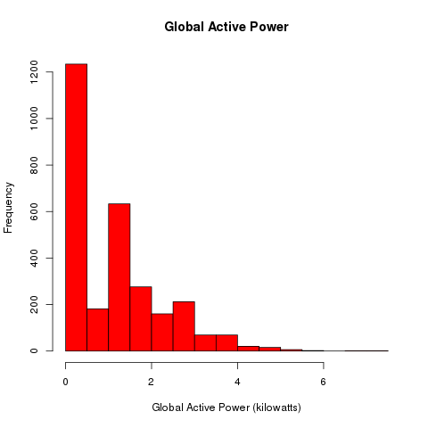

## Introduction
The overall goal here is to reconstruct the four plots provided in the sample respository, all of which were constructed using the base plotting system.

The results include:
 1. Four separate R code files (plot1.R, plot2.R, etc.) that construct the corresponding plot, i.e. code in plot1.R constructs the plot1.png plot. 
 2. Four separate files (plot1.png, plot2.png, etc.) with the sample graphs in a 480x480 transparent png file.

The scripts include code for reading the data from the [UC Irvine Machine Learning Repository](http://archive.ics.uci.edu/ml/), so that the plot can be fully reproduced.

The four original plots are shown below above the corresponding generated versions. Note that the legend for datetime variable is in spanish due to local configuration of computer that generated the plots.

### Plot 1 (Original)

### Plot 1 (Generated with plot1.R)

### Plot 2 (Original)

### Plot 2 (Generated with plot2.R)

### Plot 3 (Original)

### Plot 3 (Generated with plot3.R)

 

### Plot 4 (Original)

### Plot 4 (Generated with plot4.R)

